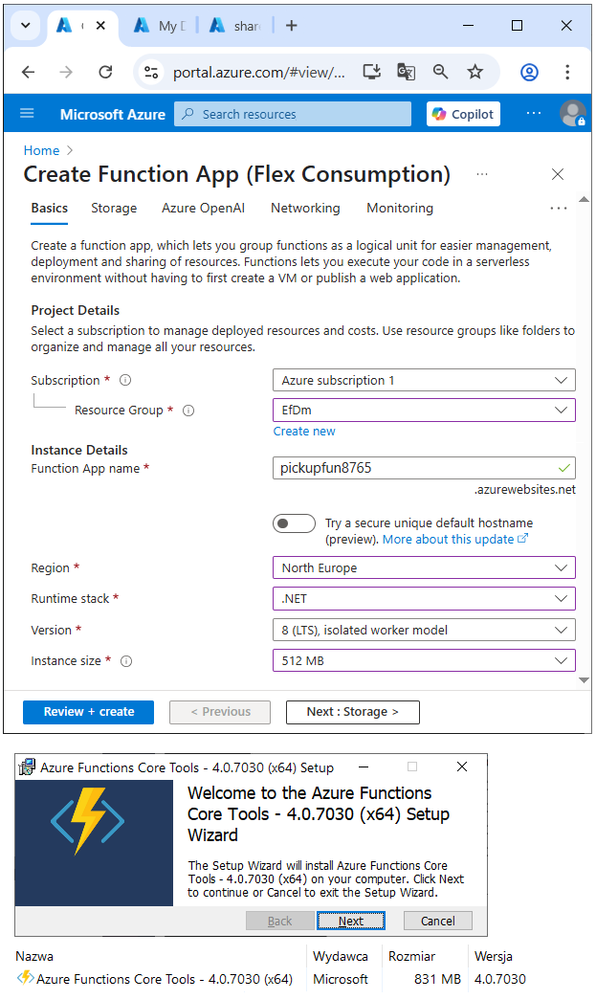
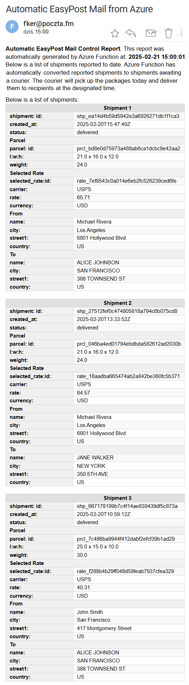

> Return to <a href="https://github.com/janluksoft/Contents#idAzure"><b>menu</b></a>.

# Azure Function: Automatic ordering of DHL courier

This project demonstrates how to send scheduled emails from an **Azure Function**. Every 5 minutes, the function sends a test HTML email using SMTP.

## 🔹 Overview

**AzureFunctionTimerDHL** is a serverless Azure Function app that runs daily at **15:00**. It automatically reads shipment data from the **EasyPost** API and sends a formatted HTML email containing shipment details to the user.

The class handling shipments can optionally and automatically transform created shipments into ordered shipments awaiting the courier's arrival via EndPoint "events".

The function is scheduled with a **TimerTrigger** and uses an **EmailService** (described in the previous AzureFunctionTimerMail project). The core new feature is the integration with EasyPost API, encapsulated in the `CShipmentsDhl` class.

---
## 🔹 About EasyPost

Many online services are supported by the REST API interface. Such an interface is used by modern shipping companies, among which EasyPost holds an important place.

EasyPost is not a single carrier, but carries out shipments through many global carriers such as: UPS, FedEx, GLS, DPD, United States Postal Service, Deushe Post, Canada Post, Australia Post and many other local carriers.

The advantage of their solution is flexibility, because they can achieve low shipping costs by synchronizing with carriers who serve a given direction most efficiently.

EasyPost is a leading brand and is known, for example, for sponsoring the top cycling team "EF Education-EasyPost". Richard Carapaz - Olympic champion and winner of the Giro d’Italia 2019 - rides in it.

---

## 🔹  Azure Functions 

### ✅ What are Azure Functions?

**Azure Functions** is a serverless compute service from Microsoft Azure.  
It lets you run small pieces of code (functions) in the cloud, without managing infrastructure.

Functions are event-driven — they are triggered by events like HTTP requests, timers, or messages in queues.

---

### ✅ Key Advantages

- **Serverless** – No server management, auto-scaling.
- **Cost-efficient** – You pay only for execution time.
- **Quick to build** – Focus on logic, not infrastructure.
- **Flexible triggers** – Respond to many types of events.
- **Easy integration** – Connect to Azure services and APIs.

---

### ✅ Typical Uses

- Scheduled tasks (e.g., cleanup, reporting)
- Lightweight APIs
- Processing queue messages
- Real-time file processing
- Integrating with other cloud services

---
## 🔹 Creating an Azure Function

The project was written in VS2022, which has extensive tools for creating Azure Functions.
Before that, you need to create a related Azure Function in Azure:

## 🔹 Technologies used in the project
* **Azure Functions (.NET isolated worker)**
* **C#** (.NET 8+)
* **Timer Trigger**
* **SMTP with `SmtpClient`**
* **Dependency Injection**
* **Logging (ILogger)**
* **Application Insights**
* **Secrets stored in custom `SecretData` class**

---

## 🔹 Project Structure

### 1. Timer Trigger Function

* Located in `DailyPickupFunction.cs`.
* Triggers at **15:00 UTC** daily.
* Creates an instance of `CShipmentsDhl`, which fetches shipment data.
* Sends the generated HTML via email using `EmailService`.

### 2. EasyPost Communication

* Implemented in `CShipmentsDhl.cs`.
* Uses the EasyPost endpoint: `https://api.easypost.com/v2/shipments`.
* Authenticates using an API key stored in `SecretData`.
* Sends an HTTP GET request.
* Parses the returned JSON using `System.Text.Json`.

### 3. HTML Email Generation

* The JSON data is transformed into a structured HTML table.
* Each shipment is shown with details like shipment ID, status, parcel dimensions, rate, sender, and recipient.
* The HTML uses inline styles for a clean and readable format.
* The email content includes a timestamp and explanatory message.

### 4. Email Sending

* Handled by the shared `EmailService` class.
* Composes the final HTML body and sends it to the configured recipient.

Below is a view of the mailbox with received emails. The Azure Function 
mechanism can therefore be used to send notifications to email. periodic

---

## 🔹 Summary

**AzureFunctionTimerDHL** automates daily shipment monitoring by integrating with EasyPost. It reads shipment info, formats it into a clear HTML table, and sends it by email. The program is serverless, scheduled, secure, and easy to maintain, making it ideal for logistics automation workflows.

---

> For more details on the reused components (e.g. EmailService, SecretData), please refer 
to the project: <a href="https://github.com/janluksoft/Azure_Functions"><b>AzureFunction_TimerMail
</b></a>.

> Another project: <a href="https://github.com/janluksoft/RestApi_Postman"><b> RestApi_Postman
</b></a> contains an example of operations on the EasyPost REST API interface.

> Return to <a href="https://github.com/janluksoft/Contents_test#idAzure"><b>menu</b></a>.

## 🔹 Email output
Email generated by Azure Function: 

